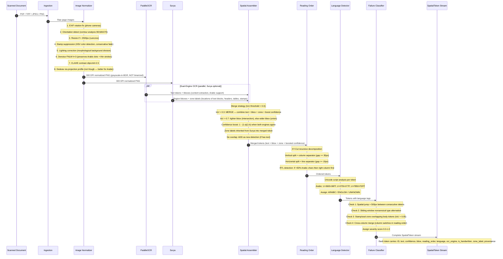
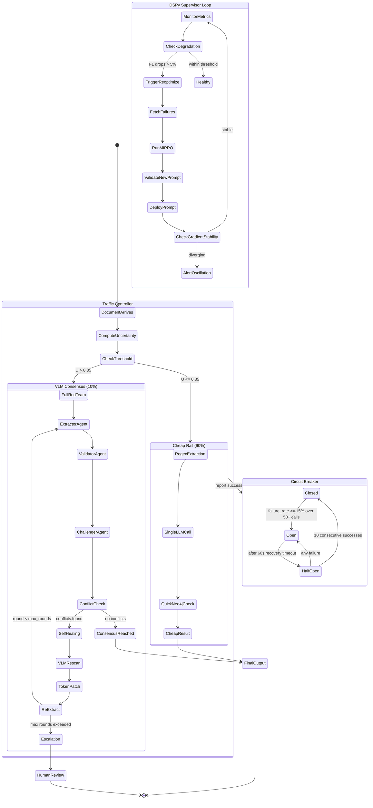
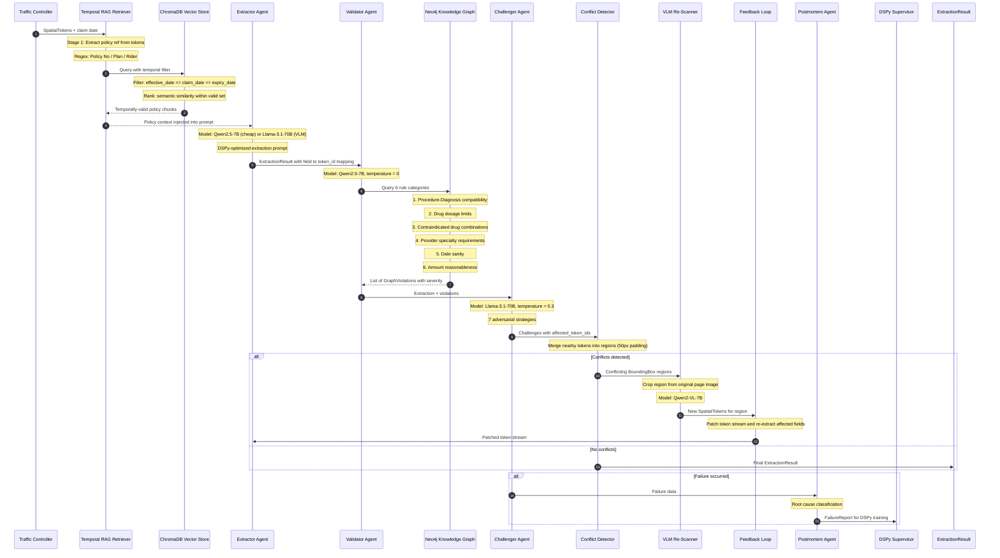
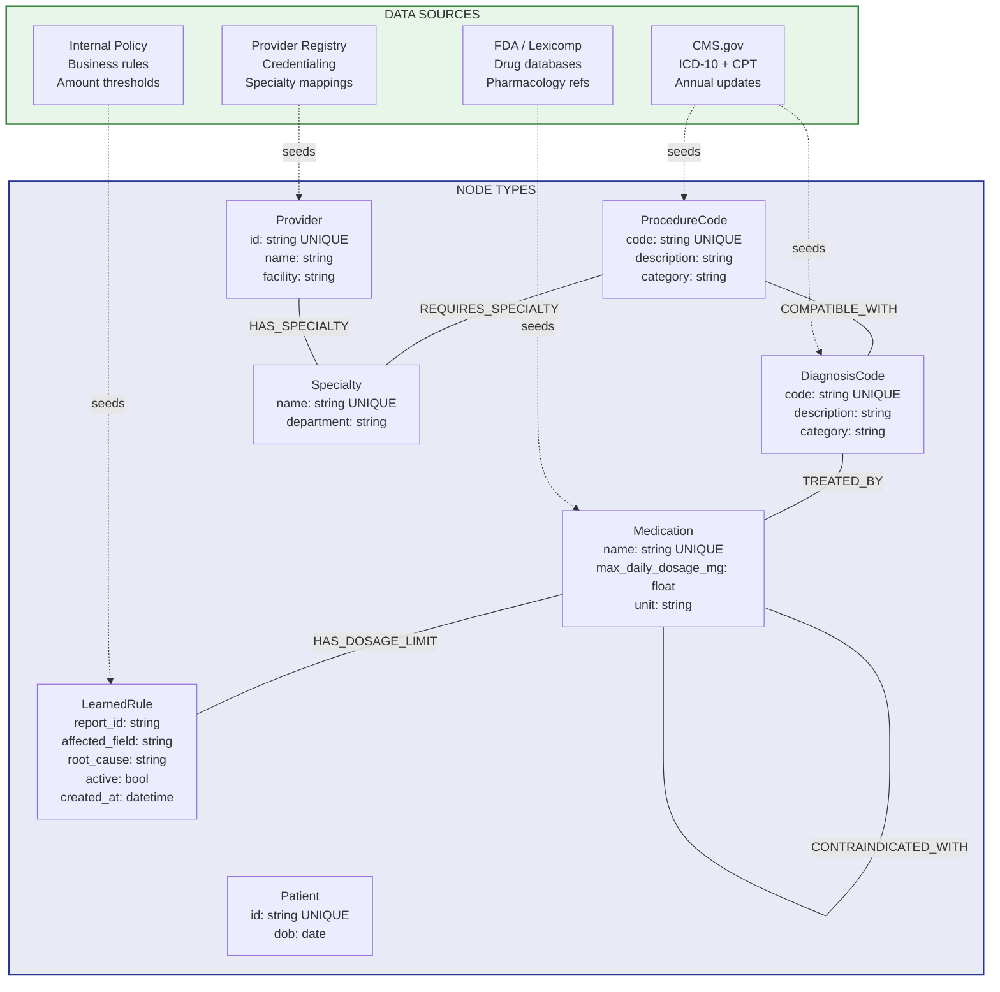

# GraphOCR — Detailed Architecture Design

**Author**: Mohamed Hussein | **Date**: 2026-03-28 | **Version**: 1.0
**System**: Hybrid Graph-OCR Deterministic Trust Layer for Insurance Claim Processing

---

## 1. System Overview

GraphOCR is a **Deterministic Trust Layer** built to process 100K complex, multi-lingual, handwritten insurance claims per day. Standard "off-the-shelf" AI pipelines fail at this institutional scale due to two fatal errors:

1. **Input Failure (Spatial-Blind OCR / Serialization Gore)**: When a pharmacy stamp overlaps a policy number or a doctor writes a diagnosis across two columns, standard OCR reads horizontally across the page, creating a "meaningless soup" of text.
2. **Intelligence Failure (Contextual Hallucination)**: Because naive RAG systems cannot "see" the paper, they retrieve the most semantically similar policy (e.g., a "2025 Standard Plan") even if the handwritten claim explicitly refers to an obsolete "2018 Rider", causing the AI to hallucinate a denial by looking at the wrong map.

GraphOCR solves this by grounding the AI in the reality of the document. The Neo4j Graph Database tests the OCR output for **"Logical Impossibilities"** (e.g., substituting an OCR typo for a clinical stoichiometric limit violation), which heavily triggers a **Back-Propagation** mechanism: using the exact bounding box coordinates to initiate a targeted VLM re-scan, completely bypassing the need to restart the batch.

### Overall Architecture

[View full-size diagram](https://l.mermaid.ai/5iIrTy)

```mermaid
flowchart TB
    subgraph INPUT["Document Intake"]
        A["Scanned Claims<br/>PDF / TIFF / JPEG / PNG<br/>Arabic + English<br/>Handwritten + Printed"]
    end

    subgraph L1["LAYER 1 — OCR + SPATIAL FOUNDATION"]
        direction TB
        B["Document Ingestion<br/>EXIF → Orientation → Resize → Stamp Suppress<br/>→ Lighting Correct → Denoise → CLAHE → Deskew<br/>Output: 300 DPI Normalized PNG"]
        C["Dual-Engine OCR<br/>PaddleOCR ← text + bboxes<br/>Surya ← layout bboxes (region locations + zone labels)"]
        D["Spatial Assembler<br/>IoU Merge θ=0.3<br/>Combine text + bbox + zone + confidence boost"]
        E["Reading Order<br/>XY-Cut Algorithm<br/>RTL Arabic Detection"]
        F["Language Detector<br/>Per-token Unicode script<br/>Arabic / English / Unknown"]
        G["Failure Classifier<br/>Type A: Spatial-Blind<br/>Spatial jumps + Sequences + Stamp overlap + Column merge"]
        B --> C --> D --> E --> F --> G
    end

    subgraph L1OUT["SpatialToken Stream"]
        H["Token ID + Text + Confidence<br/>BoundingBox x,y page<br/>Reading Order + Language<br/>Handwritten flag + Zone label<br/>OCR Engine provenance"]
    end

    subgraph L3["LAYER 3 — TIERED INFERENCE"]
        direction TB
        I["Traffic Controller<br/>Uncertainty Score with 5 weighted components<br/>Threshold T = 0.35"]
        J["CHEAP RAIL ~90%<br/>Regex + Qwen2.5-7B<br/>Quick Neo4j check<br/>~2-3 sec latency"]
        K["VLM CONSENSUS ~10%<br/>Full Red Team pipeline<br/>Multi-round adversarial<br/>~15-30 sec latency"]
        I -->|"U ≤ 0.35"| J
        I -->|"U > 0.35"| K
    end

    subgraph L2["LAYER 2 — ADVERSARIAL VERIFICATION"]
        direction TB
        L["Extractor Agent<br/>Qwen2.5-7B / Llama-3.1-70B<br/>DSPy-optimized prompts"]
        M["Validator Agent<br/>Qwen2.5-7B temp=0<br/>Neo4j 6-rule check"]
        N["Challenger Agent<br/>Llama-3.1-70B temp=0.3<br/>7 adversarial strategies"]
        CC["Consensus Check<br/>No high-conf challenges?<br/>No critical violations?"]
        O["Self-Healing Loop<br/>Conflict Detect → VLM Re-scan<br/>Token Patch → Re-extract"]
        P["Postmortem Agent<br/>Root cause → Redis FailureStore<br/>rule_gap → Neo4j LearnedRule"]
        L --> M --> N --> CC
        CC -->|"agreed"| P
        CC -->|"disagreed"| O
        O -->|"round < 2"| L
        O -->|"round >= 2"| ESC["Escalate"]
        ESC --> P
    end

    subgraph INFRA["INFRASTRUCTURE"]
        direction LR
        Q[("Neo4j 5.x<br/>Knowledge Graph<br/>Domain Rules")]
        R[("ChromaDB<br/>Vector Store<br/>Policy Embeddings")]
        S[("Redis 7<br/>Cache + Queue<br/>Failure Store")]
        T[("MinIO<br/>Object Storage<br/>Page Images")]
        U["vLLM<br/>Qwen2.5-7B<br/>Llama-3.1-70B<br/>Qwen2-VL-7B"]
    end

    subgraph MONITOR["OBSERVABILITY"]
        direction LR
        V["Langfuse Tracer<br/>Full pipeline tracing"]
        W["Circuit Breaker<br/>Sliding window 300s<br/>15% failure threshold"]
        X["DSPy Supervisor<br/>30-min check interval<br/>Gradient Monitor"]
        Y["Accuracy Tracker<br/>Rolling window<br/>Decay detection"]
    end

    subgraph OUTPUT["Final Output"]
        Z["ExtractionResult<br/>Structured fields + Confidence<br/>Source token provenance<br/>Neo4j violations + Agent verdicts<br/>Escalation flag"]
    end

    INPUT --> L1
    L1 --> L1OUT
    L1OUT --> L3
    J -->|"~90%"| OUTPUT
    K -->|"~10%"| L2
    L2 --> OUTPUT
    L3 <--> INFRA
    L2 <--> INFRA
    L3 <--> MONITOR
    L2 <--> MONITOR
    INFRA ~~~ MONITOR

    style INPUT fill:#E3F2FD,stroke:#1565C0,stroke-width:2px
    style L1 fill:#FFF3E0,stroke:#E65100,stroke-width:2px
    style L1OUT fill:#F3E5F5,stroke:#6A1B9A,stroke-width:2px
    style L2 fill:#E8F5E9,stroke:#2E7D32,stroke-width:2px
    style L3 fill:#FCE4EC,stroke:#C62828,stroke-width:2px
    style INFRA fill:#ECEFF1,stroke:#37474F,stroke-width:2px
    style MONITOR fill:#FFF8E1,stroke:#F57F17,stroke-width:2px
    style OUTPUT fill:#E0F7FA,stroke:#00695C,stroke-width:2px
```



---

## 2. Layer 1 — OCR + Spatial Foundation

Layer 1 transforms raw scanned documents into an ordered stream of `SpatialToken` objects — the atomic unit that carries provenance through the entire pipeline. Every downstream component consumes and references these tokens.

### 2.1 Processing Sequence

[View full-size diagram](https://mermaid.ai/play?utm_source=ai_live_editor&utm_medium=share#pako:eNqNVmtv4jgU_StXkVbqaAIboDwaaSoxQFp2GEDQ7s6uKlUmuQRvEztjO6W06n_f6wRop02l5UswOfd97jFPTigjdHxH488cRYhDzmLF0hsB9GG5kSJPV6jKc8aU4SHPmDAwlCEwDcuQCYGRPeYpCvMeOBaxBdIDteFSVCDSEpGyGGEqVcoS_lgVc25hcxZFCc4Gi_fvl0VGudqx9-9G9t2I6V21Zb8wzZjhLIG-1piukqoUFjMLXCCLONU1U1EVaDK0oAkTcW5LGqLB0MgKYDCwwIDxJFcIg4Rpzde8yuXy6lWCV_IOBSyNQjupEkwDqJ2fU5d9mA8D-B2uxoF9_DEfXdBjPr0ocYSwuJRwC7alGJQgt53X5fupNAjyHhUUmNGPcQBKGmZHB2v-UImaKU6zLzFRUS2chFIYmStggiU7zfWnSssFapo18DWcQ7PteVl1gCHqO9zCPWdwKfN4AwkXH2Q8mPQvR2CjK6YNoNgw4vULNwlEDZj70PI8GM7HIA6Mi151qQAt_w9o9DHoOEb4nieG10YiprSBGAgn9CtLEkz2bbGfuQ3Z96EYr4bPsFrJB9RwQkRKkEpSijpLPXahr9iKh69slx_ZJmwnc1NjW6bwFX70EX5NWa1YeAepTZnaTBw-JIkiOhT10nTrZSyvae5RniU8LFlgNgr1RiYRfAGv3q4y-o4qLo8JyzK7TmUKayVTaFGwuGrG1vIbYgYbHm9IUWo06TWPrHaBKfYiI5TCuJCa0nrZp2oXM0ujQ440IlOWvuVms6_-bSxr8uPv2iA35DDMleb3SHWGMs2k5i9i9qvFn2jXlmREUyhD9YcyyVMBGu3MSQfgJGYZnH8h3mQPn6pcXErFH4nBr5xYwle4aHzkYnE12a8ipekXC9b2ftsTB8INUxpq56Coi-aQ4ZorbQ5NW8yoaZOhX4rcsV9vY1nEteD2GgEdKp6Z48YXkyisqozKTMj4s9fxvJrXCQLXHrptOnS7xSH4SodgGASVDkgsYyqtv-h_HQ9I40bTi8l4eUnfrqffprO_podSJkMqJRgc2V6MPDnIs2Hxu6oseLBBWoOGf7wW_s1T6jkUKgUrNFskthH9NHHDWGpUd-jFV5N8Jby4ObZcRHJLikHWQhd0MbsMgSUGlWBV3LJ-ypqJB_QDNzvquKSLw6t7tUbdO5QbDOxyX1FUImpCHPj13tD7e-PNXhF-xMLNfolCpkjTNa320AWDD8aFl0Vzi31xaSmKa_BWWoa4x466IEN1W-6vC1zfkgJHW8rXIEkX8RpvE7bCxIVMUWxh9dlxnVjxyPGNytF1UiQltUfnySZ645gNSfiN49PXiKm7G-dGPJMN3Y3_SJkezJS9GxyfNEzTKc8iWvT9P5ojhEQM1UDmwjh-o1e4cPwn58Hxa81mp3566p2dnvVavfZZq91ynR2huvVuy2s2uu12p9NpeO3Ws-s8FmGb9Xav1Wg2T88avVanfdp7_g8gZQeB)



### 2.2 Document Ingestion Pipeline

The ingestion module (`layer1_foundation/ingestion.py`) normalizes raw scans through an 8-step image processing pipeline, optimized for Arabic medical documents based on Invizo (2025), Arabic OCR surveys, and PaddleOCR best practices.

**Pre-OCR steps (before pixel processing):**

1. **EXIF rotation fix**: Phone cameras embed orientation in EXIF tag 274 rather than rotating pixels. The pipeline applies the stored rotation (90/180/270) so pixels match what a human sees.
2. **Orientation detection**: OpenCV contour analysis finds text-region bounding rectangles and checks aspect ratios. If >60% of regions are taller than wide, the image is sideways (90/270). Upside-down detection compares ink density in top 15% vs bottom 15%.
3. **Auto-resize**: Images larger than 2500px (max side) are resized with Lanczos interpolation. PaddleOCR is optimal at 1500-2500px.

**Image enhancement pipeline (the `_normalize_image` function):**

4. **Stamp suppression** (`_suppress_stamps`): While still in color (BGR), converts to HSV and detects high-saturation pixels (saturation > 80, value > 50). Also targets specific stamp colors: red (hue 0-10/170-180), blue (hue 100-130), green (hue 35-85). Conservative approach: fades stamps by +80 brightness rather than erasing, preserving underlying dark ink strokes.
5. **Lighting correction** (`_correct_lighting`): Estimates background illumination via morphological closing with a large elliptical kernel (~6% of image smaller dimension). Divides the original by the background to flatten gradients from phone camera shadows. This is the single highest-impact step for phone-captured documents.
6. **Mild denoising (FNLM)**: Fast Non-Local Means (FNLM) with `h=3`, `templateWindow=7`, `searchWindow=21`. Standard aggressive denoising (`h>5`) destroys the tiny, essential diacritical dots in Arabic script (which fundamentally change character meanings, e.g., 'ب' vs 'ت'). The low threshold preserves these strokes.
7. **CLAHE contrast enhancement**: `clipLimit=2.5` (up from 2.0), `tileGridSize=8x8`. Tuned for faded medical prescription ink. Recovers diacritical dots and light strokes effectively.
8. **Deskew** (`_deskew_projection`): Projection profile analysis — rotates the binarized image in 0.2-degree steps from -5 to +5, picks the angle that maximizes horizontal projection variance (sharpest text lines). More robust than Hough lines for Arabic because Arabic has dense vertical strokes that easily confuse standard Hough transformations.

**Critical: no binarization.** PaddleOCR's internal DBNet text detector relies on grayscale spatial gradients to locate text boundries. Pre-binarizing destroys this sub-pixel gradient information and severely hurts detection accuracy. The output is grayscale-in-BGR (3-channel) for PaddleOCR compatibility.

All output images are 300 DPI grayscale PNGs, max 2500px on any side.

### 2.3 Dual-Engine OCR Strategy

The pipeline supports two modes: **PaddleOCR-only** (fast, default) and **PaddleOCR + Surya** (full accuracy, enabled via `Pipeline(use_surya=True)`).

**PaddleOCR** (text extraction): Best Arabic script support with built-in angle correction. Handles mixed Arabic/English text natively. Returns text content + bounding box polygons + per-token confidence scores. Always active — this is the primary engine for all text extraction.

**Surya** (layout region detection, optional): Outputs **bounding box coordinates** for every detected region on the page — text blocks, columns, tables, headers, footers, figures. Each region bbox comes with a zone label (Title, Text, Table, Header, Footer, Figure, Caption) and a confidence score. Surya provides two levels of output:

1. `RecognitionPredictor` (via `FoundationPredictor` + `DetectionPredictor`) → text extraction with bounding boxes, line-level confidence, and sorted reading order
2. `LayoutPredictor` (via `FoundationPredictor`) → zone-labeled bounding boxes (what TYPE of region each area is: header, body, table, stamp)

When `use_recognition=True` (default), Surya provides full text extraction alongside layout detection. When `use_recognition=False`, Surya provides only layout zones and PaddleOCR handles all text extraction.

When Surya is active, its outputs are used in three ways:
- The **spatial assembler** merges Surya region bboxes with PaddleOCR tokens — inheriting zone labels, boosting confidence where both engines agree, and refining bounding boxes
- The **metadata enricher** overlaps Surya's layout zone bboxes with remaining PaddleOCR tokens to assign `zone_label` to tokens not covered by the merge
- The **failure classifier** uses zone labels to detect stamp-over-body overlap (a STAMP-zone bbox overlapping a BODY-zone token)

| Mode | Engines | Zone Labels | Text Recognition | Stamp Detection | Confidence Boost | Latency |
|------|---------|-------------|-----------------|-----------------|------------------|---------|
| `Pipeline()` | PaddleOCR only | None | PaddleOCR | Not available | No | Fast |
| `Pipeline(use_surya=True)` | PaddleOCR + Surya | Full | Both (merged) | Active | Yes | +2-4 min/page (MPS) |
| `Pipeline(use_surya=True, use_paddle=False)` | Surya only | Full | Surya | Active | No | +2-4 min/page (MPS) |

### 2.4 Spatial Assembler — Token Merge Strategy

The spatial assembler (`layer1_foundation/spatial_assembler.py`) merges token streams from both engines. Instead of discarding overlapping detections, it **combines the best attributes of both** into a single enriched token.

**Merge logic** (when IoU >= 0.3 between a PaddleOCR token and a Surya region):

| Attribute | Source | Strategy |
|-----------|--------|----------|
| Text | PaddleOCR (higher confidence) | Surya has no text — PaddleOCR always provides content |
| Bounding box | Both | **Union** (IoU 0.3-0.7) for coverage, **intersection** (IoU > 0.7) for precision |
| Confidence | Both | **Boosted**: `1 - (1 - conf_a) * (1 - conf_b)` — two independent detectors agreeing |
| Zone label | Surya | Inherited (HEADER, BODY, STAMP, TABLE) — PaddleOCR doesn't detect zones |
| Language | Either | Prefer non-UNKNOWN |
| Handwriting | Either | OR — if either detects it, flag it |
| Engine | Both | Recorded as `"paddleocr+surya"` for provenance |

**IoU threshold is 0.3** (not 0.5) — different engines produce slightly different bounding boxes for the same text region. 0.3 catches these partial overlaps while avoiding false merges of genuinely separate regions.

**Confidence boosting formula**: When PaddleOCR detects a region at 0.7 confidence and Surya independently detects the same region at 0.8 confidence, the merged confidence is `1 - (1-0.7)(1-0.8) = 0.94`. Two independent detectors agreeing is stronger evidence than either alone.

The assembler also groups tokens into logical lines (`group_into_lines()` with 10px Y-tolerance).

### 2.5 Reading Order — XY-Cut with RTL Awareness

The **XY-Cut algorithm** (`layer1_foundation/reading_order.py`) is a well-established technique for Document Image Analysis (DIA). It recursively decomposes the page into columns and rows by finding the widest horizontal and vertical "valleys" (white spaces) between token clusters to build a hierarchical reading tree. 

Vertical splits (gap >= 30px) detect column separators, while horizontal splits (gap >= 10px) detect line separators. Crucially, when >50% of tokens in a group contain Arabic script characters, the reading order dynamically reverses: the right column is read before the left column. This context-aware spatial serialization prevents the "serialization gore" (e.g. reading haphazardly across two distinct medical columns) described in the problem brief.

### 2.6 Failure Classifier — Type A Detection

The failure classifier (`layer1_foundation/failure_classifier.py`) detects four patterns of Type A (spatial-blind) failure. All four checks return `suggested_remedy="vlm_rescan"` — triggering a targeted VLM re-scan of the affected bounding box region rather than restarting the batch.

Token classification: The internal `_token_type()` helper classifies each token as `num` (digits, punctuation, currency symbols `$€£¥`), `text` (Latin + Arabic `U+0600-06FF`), `mixed`, or `empty` using regex. This classification drives Check 2.

1. **Spatial jumps**: Consecutive tokens in reading order >800px apart spatially, both with confidence >0.7. Severity scales linearly: `min(1.0, distance / 1000)`. Threshold tuned for 2500px images — handwriting can wander ~500px without being a real column merge.
2. **Nonsensical type alternation**: Sliding window of 5 tokens checking for rapid alternation between numeric and text content (e.g., num-text-num-text-num) — classic horizontal-scan corruption. Requires >= 4 alternations within the window. Severity: hardcoded `0.6`.
3. **Stamp/seal overlap**: Detects bounding box overlap (IoU > 0.05) between tokens in STAMP/LOGO/SIGNATURE zones and BODY/HEADER/TABLE_CELL tokens (plus tokens with no zone label, which default to body context). Catches the "pharmacy stamp overlaps a policy number" scenario. Severity: `min(1.0, 0.5 + 0.1 * overlapping_body_count)` — scales from 0.6 to 1.0 with the number of obscured body tokens.
4. **Cross-column merge**: Requires at least 10 tokens on the page and an X-spread >= 40% of page width before activating (prevents false positives on single-column handwritten prescriptions where text wanders). Clusters tokens into left/right columns by X-center (with 15%-of-page-width dead zone). Requires both columns to have >= `max(4, 20% of total tokens)`. Switch threshold scales with document size (`max(3, tokens/10)`). Severity: `min(1.0, 0.4 + 0.05 * switches)`.

### 2.7 The SpatialToken — Metadata Schema

Every token in the system is a `SpatialToken` (`models/token.py`) carrying: token_id (UUID7, time-ordered), text, confidence, BoundingBox (x_min, y_min, x_max, y_max, page_number), reading_order, language, ocr_engine, is_handwritten, zone_label, line_group_id, and normalized_text. The `to_provenance_str()` method generates audit-ready strings like `[a1b2c3d4] 'metformin' page=1 (234,567)-(345,589) conf=0.92 lang=en engine=paddleocr`.

This is the **Single Source of Truth** — both senior and junior engineers consume the same schema. Every extraction field downstream carries `source_tokens` (list of token_ids), enabling coordinate-level traceability from final output back to pixel positions on the original scan.

---

## 3. Layer 3 — Tiered Inference & Monitoring

### 3.1 Traffic Controller & Circuit Breaker State Machine

[View full-size diagram](https://l.mermaid.ai/NnrkM6)



### 3.2 Uncertainty Score — Mathematical Definition

The Traffic Controller computes an uncertainty score U for every document:

```
U = (1 - C̄) + 0.15 · R_hw + 0.02 · R_mix + 0.10 · S_fail + 0.10 · H_norm
```

Where: **C̄** = mean OCR confidence, **R_hw** = handwriting ratio (weight 0.15), **R_mix** = language mixing entropy (weight 0.02, tuned down from 0.05 — mixed ar/en is normal for medical docs), **S_fail** = max failure severity (weight 0.10, tuned down from 0.20 — handwritten docs naturally have spatial irregularity), **H_norm** = normalized confidence entropy (weight 0.10). Threshold T = 0.35 (`cheap_rail_confidence_threshold = 0.65`); documents with U <= 0.35 go to cheap rail, the rest to VLM consensus.

### 3.3 Circuit Breaker

Three-state sliding-window pattern: **CLOSED** (normal, tracking failures) -> **OPEN** (disabled, when failure rate >= 15% over 50+ calls in 300s) -> **HALF_OPEN** (testing, after 60s timeout; 10 consecutive successes close, any failure reopens). Thread-safe with `threading.Lock`.

### 3.4 Accuracy Monitoring & Decay Detection

The `AccuracyTracker` detects gradual accuracy decay using linear regression over a 60-minute window. If the slope is negative beyond -0.001, it signals systemic degradation. Combined with the circuit breaker, this automates the "2:00 PM accuracy dip" response.

### 3.5 DSPy Supervisor — Automated Prompt Maintenance (MIPRO)

The pipeline employs an Agentic Supervisor using **MIPRO (Multi-prompt Instruction PRoposal Optimizer)**, a sophisticated Bayesian optimizer within the DSPy framework. Instead of manual "prompt hacking," MIPRO treats prompt engineering as a machine learning problem by jointly optimizing instructions and few-shot examples via data-driven trials.

Background async loop on 30-minute intervals:
1. Fetch module performance metrics from the Langfuse API.
2. Check for metric degradation against an F1 baseline of `0.92`.
3. If degradation > 5%, mathematically trigger a MIPRO reoptimization trial (max 3/day) utilizing real historical failure data curated closely by the Postmortem agent.
4. Monitor textual gradient stability via `GradientMonitor`, tracking prompt sequence similarity and directional consistency to prevent the prompts from hallucinating or oscillating over time.

### 3.6 DSPy Mentorship Mode — Gradient Explanation Interface

The DSPy Supervisor doubles as an **Agentic Mentor** for junior engineers working with DSPy prompt optimization. When a junior triggers a DSPy optimization run or reviews supervisor logs, the Mentor Mode generates human-readable explanations of what the textual gradients are doing and why.

**How textual gradients work (the explanation the Supervisor provides)**: In DSPy's MIPRO optimizer, "textual gradients" are natural-language feedback signals that describe *how* a prompt should change to improve a metric. Unlike numerical gradients in neural networks, these are LLM-generated critiques: e.g., "The prompt failed to extract the drug dosage because it didn't instruct the model to check for Arabic numeral formats." MIPRO uses these critiques to propose new prompt candidates in the next optimization trial.

**What the Mentor Mode explains in real-time**:
1. **Gradient direction**: "The optimizer is pushing the extraction prompt toward more explicit Arabic character handling — 3 of the last 5 gradient signals mention Arabic digit confusion (٥ vs 5)."
2. **Convergence status**: "Prompt quality score has plateaued at F1=0.94 for the last 4 trials. The gradients are becoming contradictory (one says 'be more specific about dates', another says 'be more general about formats') — this indicates convergence. No further optimization needed."
3. **Drift/oscillation alerts with cause**: "WARNING: The prompt is oscillating between two states — Trial 7 added a rule about stamp regions, Trial 8 removed it, Trial 9 re-added it. Root cause: the training examples contain conflicting stamp-handling cases. Action: review the 3 flagged training examples in the Langfuse dashboard."
4. **Hallucination detection**: "The optimizer proposed a prompt that references 'ICD-11 codes' — but our Neo4j graph only contains ICD-10. This gradient is hallucinated. The Supervisor has rejected this trial and logged it."

**Implementation** (`dspy_layer/supervisor.py`): The `MentorMode` class hooks into the `GradientMonitor` and generates structured explanation logs after each optimization cycle. These are exposed via the `/supervisor/status` API endpoint and the `graphocr supervisor-status` CLI command. Each explanation includes: the raw gradient text, a plain-language interpretation, the metric delta, and a recommended action (continue, stop, or review training data). This ensures junior engineers understand *why* prompts are changing rather than treating DSPy as a black box.

---

## 4. Layer 2 — Adversarial Verification & Self-Healing

Layer 3 is the core intelligence layer. It uses four specialized agents in an adversarial configuration, a Neo4j knowledge graph for deterministic constraint checking, temporal-aware RAG for policy retrieval, and a self-healing loop that re-scans specific document regions when conflicts are detected.

### 4.1 Agent Pipeline Sequence

[View full-size diagram](https://l.mermaid.ai/N7opyw)



### 4.2 Agent Roles & Model Selection

Each agent uses a deliberately different model and temperature to serve its role:

**Extractor Agent** (`agents/extractor.py`): Uses Qwen2.5-7B for cheap rail or Llama-3.1-70B for VLM consensus path. Temperature 0.1. The extraction prompt is DSPy-optimized and includes the full spatial token stream with bounding box coordinates, reading order, language tags, and zone labels. Every extracted field carries `source_tokens`. The policy context from the temporal RAG retriever is injected directly into the prompt.

**Validator Agent** (`agents/validator.py`): Uses Qwen2.5-7B at temperature 0 — fully deterministic. Its sole job is to run Neo4j constraint queries against the extraction results. It does not generate or interpret text; it executes structured graph queries and returns pass/fail verdicts with severity scores. This agent is the "deterministic anchor" of the pipeline.

**Challenger Agent** (`agents/challenger.py`): Uses Llama-3.1-70B at temperature 0.3 — intentionally more creative. It adversarially questions the extraction using 7 domain-specific strategies: (1) Arabic character confusion pairs, (2) OCR digit errors, (3) stamp obscuration, (4) merged line items, (5) date format ambiguity, (6) currency symbol misreads, (7) handwriting ambiguity. It produces up to 5 challenges per round, each with confidence and affected token_ids.

**Postmortem Agent** (`agents/postmortem.py`): Uses Qwen2.5-7B. Classifies failures into 4 root causes: `ocr_misread`, `prompt_failure`, `rule_gap`, `layout_confusion`. Tags cases with `add_to_dspy_training=True` to feed the self-healing loop.

### 4.3 Temporal RAG — Curing Contextual Hallucinations

Standard RAG systems commit **Contextual Hallucination** because they retrieve policies based purely on text similarity (e.g., retrieving a "2025 Standard Plan" when the claim needs an "Obsolete 2018 Rider"). The Temporal Policy Retriever (`rag/retriever.py`) overrides this to ensure the AI evaluates the claim against the correct historical rulebook.

**Important — Claims vs Policies**: The pipeline works with two different document types. **Claims** are the scanned paper documents (handwritten prescriptions, receipts, doctor notes) that OCR processes into SpatialTokens. **Policies** are the insurance contracts (coverage rules, exclusions, benefit limits) written by the insurance company before any claim is filed. ChromaDB stores **policies only** — every version of every plan, rider, and amendment, pre-ingested via `scripts/ingest_policies.py`. OCR output (claims) is **never stored in the vector database** — it only queries against it. The retriever extracts keywords from the SpatialTokens (policy reference, dates, ICD codes) and searches the policy store to find the correct historical version. Without the correct policy, the system cannot determine if a claim should be approved or denied.

**Stage 1 (EXTRACT)**: Regex extraction of policy reference and explicit Dates of Service directly from the Spatial Tokens.
**Stage 2 (FILTER)**: Hard temporal filtering on ChromaDB (`effective_date <= claim_date <= expiry_date`). It ignores semantic similarity until the temporal and version constraints match.
**Stage 3 (RANK)**: Semantic similarity within the temporally-filtered set using `multilingual-e5-large` embeddings. This prevents "Intelligence Failure" by ensuring the LLM is never looking at the wrong roadmap.

### 4.4 Neo4j Knowledge Graph — Hybrid Graph-OCR Validation

The Neo4j Knowledge Graph is the ultimate adjudicator that catches **Logical Impossibilities** caused by OCR serialization gore. Instead of passively accepting OCR output, the Validator Agent ensures the data obeys strict medical and logical realities.

It executes Cypher queries against domain rules to detect impossibilities:
- **Clinical/Stoichiometric rules:** e.g., if OCR misreads "15 mg" as "1500 mg", the graph catches that it exceeds the `max_daily_dosage_mg`.
- **Chronological impossibilities:** e.g., detecting a "1940 birthdate on a 2026 policy".
- **Medical compatibility:** e.g., identifying when contraindicated drug combinations (Warfarin + Aspirin) are seemingly prescribed due to column merging.

### 4.5 Neo4j Data Model

[View full-size diagram](https://l.mermaid.ai/GmwBvE)



### 4.6 Neo4j Data Construction

The graph is constructed through two mechanisms:

**Seed-time construction**: The `scripts/seed_neo4j.py` script reads `config/neo4j_rules.yaml` and populates Neo4j via the `SchemaLoader` class. Seeding order: entity nodes first (ProcedureCode, DiagnosisCode, Medication, Specialty), then relationships (COMPATIBLE_WITH, CONTRAINDICATED_WITH, REQUIRES_SPECIALTY), then validation constraints. Unique indexes enforce data integrity.

**Data sources for Neo4j**: CMS.gov for ICD-10/CPT codes (annual updates), FDA/Lexicomp/First Databank for drug data (quarterly), internal business rules for amounts/dates (as needed), and provider credentialing registry for specialty mappings (monthly).

**Runtime enrichment**: When the Postmortem Agent identifies a `rule_gap` root cause, it automatically creates a `LearnedRule` node in Neo4j via `_update_neo4j_rules()` (`agents/postmortem.py`). The node records `report_id`, `affected_field`, `original_value`, `corrected_value`, and `root_cause` — closing the self-healing loop so future claims benefit from the learned constraint.

### 4.7 Self-Healing Back-Propagation Loop

[View full-size diagram](https://l.mermaid.ai/SW5P8t)

```mermaid
flowchart LR
    subgraph DETECT["1. CONFLICT DETECTION"]
        direction TB
        A["Challenger raises challenge<br/>confidence > 0.6"]
        B["Validator finds violation<br/>severity > 0.7"]
        C["Extractor field<br/>confidence < 0.5"]
        A --> D["Collect affected token_ids"]
        B --> D
        C --> D
        D --> E["Lookup SpatialToken bboxes"]
        E --> F["Group by page_number"]
        F --> G["Greedy merge with 50px padding"]
        G --> H["Conflicting BoundingBox regions"]
    end

    subgraph RESCAN["2. TARGETED VLM RE-SCAN"]
        direction TB
        I["Load original page PNG<br/>from MinIO"]
        J["PIL crop: region coords<br/>Clamp to image bounds"]
        K["Encode cropped region<br/>to base64 PNG"]
        L["Send to Qwen2-VL-7B<br/>via vLLM OpenAI API"]
        M["Specialized prompt:<br/>Arabic char confusion<br/>Digit misreads<br/>Stamp obscuration<br/>Handwriting"]
        N["Parse VLM JSON response<br/>into new SpatialTokens"]
        I --> J --> K --> L --> M --> N
    end

    subgraph PATCH["3. TOKEN STREAM PATCH"]
        direction TB
        O["Remove old tokens<br/>in conflict regions"]
        P["Insert VLM rescan tokens"]
        Q["Re-sort by page + position"]
        R["Re-assign reading order"]
        S["Identify affected fields<br/>via field to token_id mapping"]
        T["Re-extract ONLY<br/>affected fields"]
        O --> P --> Q --> R --> S --> T
    end

    subgraph LEARN["4. POSTMORTEM LEARNING"]
        direction TB
        U["Classify root cause"]
        V["Generate FailureReport<br/>with corrected_value"]
        W["Tag: add_to_dspy_training"]
        X["Store in Redis FailureStore"]
        Y["DSPy Supervisor pulls<br/>at 30-min intervals"]
        Z["MIPRO reoptimization<br/>max 3/day"]
        U --> V --> W --> X --> Y --> Z
    end

    H --> I
    N --> O
    T -->|"round < 2"| DETECT
    T -->|"round >= 2"| ESCALATE["Escalate to human review"]
    T --> U

    style DETECT fill:#FCE4EC,stroke:#C62828,stroke-width:2px
    style RESCAN fill:#E3F2FD,stroke:#1565C0,stroke-width:2px
    style PATCH fill:#E8F5E9,stroke:#2E7D32,stroke-width:2px
    style LEARN fill:#FFF3E0,stroke:#E65100,stroke-width:2px
    style ESCALATE fill:#F3E5F5,stroke:#6A1B9A,stroke-width:2px
```



**Phase 1 — Conflict Detection (Logical Impossibilities)**: The Neo4j Graph checks for Logical Impossibilities. It collects token_ids from high-confidence challenges (>0.6), severe graph violations (>0.7), and low-confidence fields (<0.5). Groups by page, merges nearby tokens with 50px padding into minimal re-scan regions.

**Phase 2 — Back-Propagation (Targeted VLM Re-Scan)**: When a logical conflict is identified, back-propagation kicks in. It crops the conflicting region from the original page image using exact bounding box coordinates, encodes to base64, and sends to Qwen2-VL-7B with a specialized prompt targeting Arabic character confusion, digit misreads, stamp obscuration, and handwriting. *This avoids restarting the entire 100k-doc batch.*

**Phase 3 — Token Stream Patch**: Removes old tokens in conflict regions, inserts VLM rescan tokens, re-sorts by position, re-assigns reading order. Only affected fields are re-extracted — not the entire document.

**Phase 4 — Postmortem Learning**: Classifies root cause, stores FailureReport in Redis, tags for DSPy training. The DSPy Supervisor pulls reports every 30 minutes for MIPRO reoptimization (max 3/day).

The loop runs up to 2 rounds. If consensus isn't reached, the document is escalated to human review with full provenance.

---

## 5. Data Sources Summary

### 5.1 What Feeds Neo4j

| Source | Data | Update Frequency |
|---|---|---|
| CMS.gov | ICD-10 codes, CPT codes, valid pairs | Annually (October) |
| FDA / Lexicomp / First Databank | Drug names, max dosages, contraindications | Quarterly |
| Internal Policy (Actuarial) | Amount limits, date ranges, age limits | As needed |
| Provider Registry | Provider-specialty credentialing | Monthly |
| Postmortem Feedback | New rules from rule_gap root causes | Runtime (human-reviewed) |

### 5.2 What Feeds ChromaDB

| Source | Data | Metadata |
|---|---|---|
| Policy library | Every version of every plan, rider, endorsement, amendment | policy_number, effective_date, expiry_date, jurisdiction, section_title |
| Embedding model | multilingual-e5-large (balanced Arabic/English) | Sentence transformers |
| Chunking | PolicyChunker preserves section headers, ~200-500 tokens/chunk | Parent policy ID for context |

### 5.3 What Feeds the Self-Healing Loop

| Source | Stored In | Consumed By |
|---|---|---|
| Postmortem Agent FailureReports | Redis FailureStore | DSPy Supervisor |
| DSPy Supervisor reoptimized prompts | Filesystem (versioned) | Extractor Agent |
| Gradient Monitor stability snapshots | In-memory | DSPy Supervisor alerts |

---

## 6. Infrastructure

| Service | Image | Port | Purpose |
|---|---|---|---|
| Neo4j 5.x | neo4j:5-community | 7474, 7687 | Knowledge graph with APOC plugin |
| Redis 7 | redis:7-alpine | 6379 | Cache, queue, failure store |
| MinIO | minio/minio | 9000, 9001 | Object storage for page images |
| vLLM (GPU) | vllm/vllm-openai | 8000 | Serves Qwen2.5-7B, Llama-3.1-70B, Qwen2-VL-7B |

### API: POST `/process`, GET `/health`, GET `/metrics`, GET `/supervisor/status`, GET `/audit/stats`, GET `/audit/failure/{report_id}`, GET `/audit/metadata-schema`, GET `/audit/learned-rules`
### CLI: `graphocr process FILE`, `graphocr serve`, `graphocr seed-graph`, `graphocr supervisor-status`

### 6.1 Federated Architecture & Sovereign Data Compliance

The pipeline operates under **federated deployment constraints** where health data must respect jurisdictional sovereignty (e.g., Gulf Cooperation Council data residency laws, HIPAA for US-originated claims, GDPR for EU policyholders).

**Jurisdictional Routing** (`compliance/jurisdiction.py`): Every incoming document is tagged with a `jurisdiction_code` derived from the policy metadata or claim origin. The Traffic Controller consults a jurisdiction registry before routing — documents are processed exclusively within infrastructure zones that satisfy their data residency requirements. A claim originating from Saudi Arabia is processed on Saudi-resident infrastructure; it never leaves the jurisdiction boundary, even for VLM re-scan.

**Data Residency Enforcement** (`compliance/data_residency.py`): Enforces three constraints:
1. **Storage locality**: MinIO object storage is partitioned by jurisdiction. Page images and intermediate SpatialToken streams are written only to the jurisdiction-local MinIO instance.
2. **Processing locality**: vLLM inference endpoints are deployed per-region. The pipeline configuration maps each jurisdiction to its local vLLM endpoint, ensuring no raw document data crosses sovereign boundaries during LLM inference.
3. **Graph isolation**: Neo4j can be deployed as a federated cluster with jurisdiction-scoped databases. Each jurisdiction's claims are validated against a local graph partition containing its own policy rules, provider registry, and learned rules. Cross-jurisdiction queries (e.g., a provider credentialed in multiple countries) use read-only graph projections that expose only non-PII metadata.

**Audit trail**: Every SpatialToken and ExtractionResult carries a `jurisdiction_code` field. The Langfuse tracer logs jurisdiction routing decisions, enabling compliance auditors to verify that no data crossed a sovereignty boundary during processing.

**Federated self-healing**: Postmortem-generated `LearnedRule` nodes are scoped to their originating jurisdiction by default. A global review queue allows compliance-approved rules to be promoted across jurisdictions when they represent universal medical/logical constraints (e.g., drug dosage limits) rather than jurisdiction-specific policy rules.

---

## 7. File-to-Architecture Mapping

| Component | Source Files |
|---|---|
| Document Ingestion | `layer1_foundation/ingestion.py` |
| Dual-Engine OCR | `layer1_foundation/ocr_engine.py`, `ocr_paddleocr.py`, `ocr_surya.py` |
| Spatial Assembly + Merge | `layer1_foundation/spatial_assembler.py`, `metadata_enricher.py` |
| Reading Order | `layer1_foundation/reading_order.py` |
| Language Detection | `layer1_foundation/language_detector.py` |
| Failure Classification | `layer1_foundation/failure_classifier.py` |
| SpatialToken Schema | `models/token.py` |
| Neo4j Node Models | `models/graph_nodes.py` (Pydantic models for DiagnosisCode, ProcedureCode, Medication, Provider, Patient) |
| Extractor Agent | `layer2_verification/agents/extractor.py` |
| Validator Agent | `layer2_verification/agents/validator.py` |
| Challenger Agent | `layer2_verification/agents/challenger.py` |
| Postmortem Agent | `layer2_verification/agents/postmortem.py` |
| Neo4j Rules | `layer2_verification/knowledge_graph/client.py`, `rule_engine.py`, `validators.py`, `schema_loader.py` |
| Self-Healing | `layer2_verification/self_healing/conflict_detector.py`, `vlm_rescanner.py`, `feedback_loop.py` |
| Temporal RAG | `rag/retriever.py`, `vector_store.py`, `policy_chunker.py`, `context_injector.py` |
| Traffic Controller | `layer3_inference/traffic_controller.py` |
| Cheap Rail | `layer3_inference/cheap_rail.py` |
| VLM Consensus | `layer3_inference/vlm_consensus.py` |
| Circuit Breaker | `layer3_inference/circuit_breaker.py` |
| Monitoring | `monitoring/langfuse_tracer.py`, `metrics_collector.py` |
| Failure Store | `layer2_verification/agents/failure_store.py` |
| DSPy Layer | `dspy_layer/modules.py`, `optimizers.py`, `metrics.py`, `supervisor.py`, `gradient_monitor.py` |
| Pipeline Orchestrator | `pipeline.py` (end-to-end: `Pipeline.process()`, `Pipeline.process_batch()`) |
| Compliance | `compliance/jurisdiction.py`, `compliance/data_residency.py` |
| Audit & Diagnostics | `audit/dashboard.py` (failure stats, metadata schema, learned rules), `audit/failure_analyzer.py` (Type A/B classification, jurisdiction-scoped queries) |
| Core Utilities | `core/exceptions.py` (custom exception hierarchy), `core/logging.py` (structlog setup), `core/async_utils.py` (SemaphorePool, async_retry decorator), `core/config.py` (YAML settings loader) |
| Configuration | `config/pipeline.yaml`, `agents.yaml`, `neo4j_rules.yaml`, `dspy_config.yaml`, `monitoring.yaml`, `rag.yaml` |
| API + CLI | `app.py`, `cli.py` |
| Scripts | `scripts/batch_test.py`, `scripts/test_document.py`, `scripts/calibrate_threshold.py`, `scripts/seed_neo4j.py`, `scripts/ingest_policies.py` |
| Sample Data | `sample data/images/` (3 handwritten Arabic prescriptions — stamps, photos, QR codes, mixed layout), `sample data/pdfs/` (3 synthetic PDFs — column issue, logical conflict, low confidence). See [`sample data/README.md`](sample%20data/README.md) for what each document tests. |
