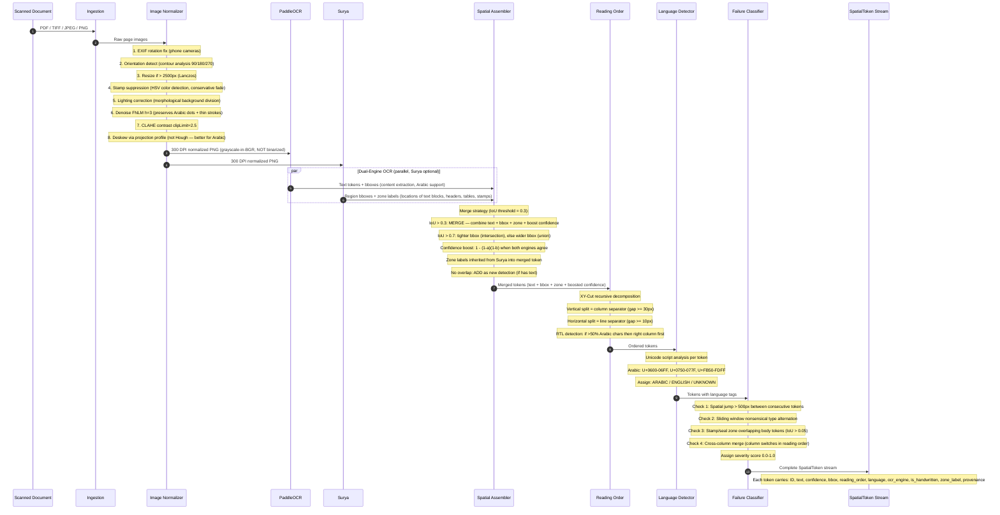
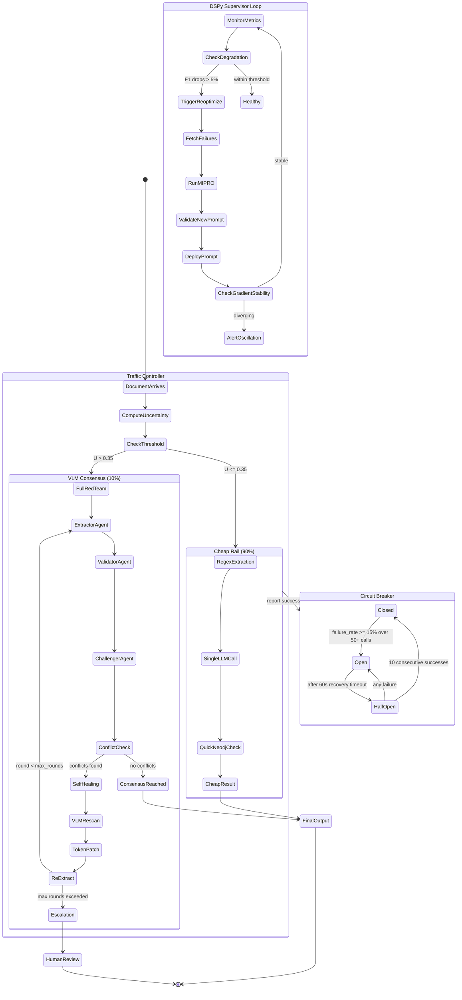
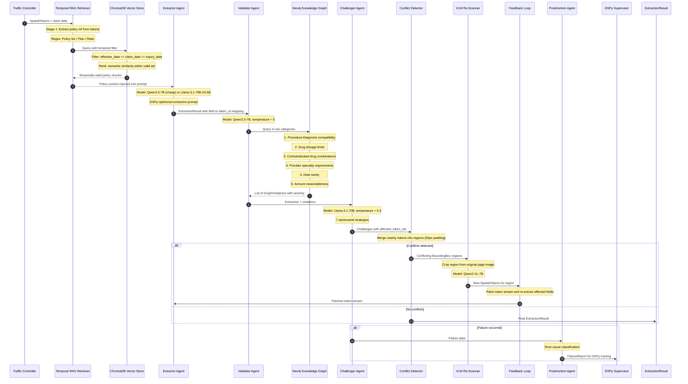
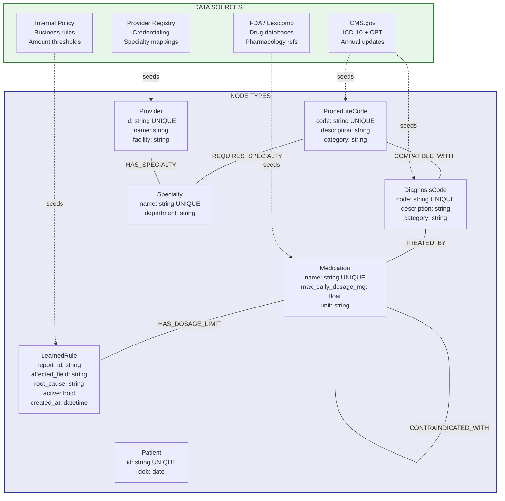

# GraphOCR — Architecture Overview

**Author**: Mohamed Hussein | **Date**: 2026-03-28 | **Version**: 1.0
**System**: Hybrid Graph-OCR Deterministic Trust Layer for Insurance Claim Processing

---

## 1. System Overview

GraphOCR is a **Deterministic Trust Layer** built to process 100K complex, multi-lingual, handwritten insurance claims per day. Standard "off-the-shelf" AI pipelines fail at this institutional scale due to two fatal errors:

1. **Input Failure (Spatial-Blind OCR)**: When a pharmacy stamp overlaps a policy number or a doctor writes a diagnosis across two columns, standard OCR reads horizontally across the page, creating a "meaningless soup" of text.
2. **Intelligence Failure (Contextual Hallucination)**: Because naive RAG systems cannot "see" the paper, they retrieve the most semantically similar policy (e.g., a "2025 Standard Plan") even if the handwritten claim explicitly refers to an obsolete "2018 Rider", causing the AI to hallucinate a denial by looking at the wrong map.

GraphOCR solves this by grounding the AI in the reality of the document. The Neo4j Graph Database tests the OCR output for **"Logical Impossibilities"** (e.g., a drug dosage of 1500 mg when the max is 15 mg), which triggers a **Back-Propagation** mechanism: using the exact bounding box coordinates to initiate a targeted VLM re-scan, completely bypassing the need to restart the batch.

### Overall Architecture

[View full-size diagram](https://l.mermaid.ai/5iIrTy)

```mermaid
flowchart TB
    subgraph INPUT["Document Intake"]
        A["Scanned Claims<br/>PDF / TIFF / JPEG / PNG<br/>Arabic + English<br/>Handwritten + Printed"]
    end

    subgraph L1["LAYER 1 — OCR + SPATIAL FOUNDATION"]
        direction TB
        B["Document Ingestion<br/>EXIF → Orientation → Resize → Stamp Suppress<br/>→ Lighting Correct → Denoise → CLAHE → Deskew<br/>Output: 300 DPI Normalized PNG"]
        C["Dual-Engine OCR<br/>PaddleOCR ← text + bboxes<br/>Surya ← layout bboxes (region locations + zone labels)"]
        D["Spatial Assembler<br/>IoU Merge θ=0.3<br/>Combine text + bbox + zone + confidence boost"]
        E["Reading Order<br/>XY-Cut Algorithm<br/>RTL Arabic Detection"]
        F["Language Detector<br/>Per-token Unicode script<br/>Arabic / English / Unknown"]
        G["Failure Classifier<br/>Type A: Spatial-Blind<br/>Spatial jumps + Sequences + Stamp overlap + Column merge"]
        B --> C --> D --> E --> F --> G
    end

    subgraph L1OUT["SpatialToken Stream"]
        H["Token ID + Text + Confidence<br/>BoundingBox x,y page<br/>Reading Order + Language<br/>Handwritten flag + Zone label<br/>OCR Engine provenance"]
    end

    subgraph L3["LAYER 3 — TIERED INFERENCE"]
        direction TB
        I["Traffic Controller<br/>Uncertainty Score with 5 weighted components<br/>Threshold T = 0.35"]
        J["CHEAP RAIL ~90%<br/>Regex + Qwen2.5-7B<br/>Quick Neo4j check<br/>~2-3 sec latency"]
        K["VLM CONSENSUS ~10%<br/>Full Red Team pipeline<br/>Multi-round adversarial<br/>~15-30 sec latency"]
        I -->|"U ≤ 0.35"| J
        I -->|"U > 0.35"| K
    end

    subgraph L2["LAYER 2 — ADVERSARIAL VERIFICATION"]
        direction TB
        L["Extractor Agent<br/>Qwen2.5-7B / Llama-3.1-70B<br/>DSPy-optimized prompts"]
        M["Validator Agent<br/>Qwen2.5-7B temp=0<br/>Neo4j 6-rule check"]
        N["Challenger Agent<br/>Llama-3.1-70B temp=0.3<br/>7 adversarial strategies"]
        CC["Consensus Check<br/>No high-conf challenges?<br/>No critical violations?"]
        O["Self-Healing Loop<br/>Conflict Detect → VLM Re-scan<br/>Token Patch → Re-extract"]
        P["Postmortem Agent<br/>Root cause → Redis FailureStore<br/>rule_gap → Neo4j LearnedRule"]
        L --> M --> N --> CC
        CC -->|"agreed"| P
        CC -->|"disagreed"| O
        O -->|"round < 2"| L
        O -->|"round >= 2"| ESC["Escalate"]
        ESC --> P
    end

    subgraph INFRA["INFRASTRUCTURE"]
        direction LR
        Q[("Neo4j 5.x<br/>Knowledge Graph<br/>Domain Rules")]
        R[("ChromaDB<br/>Vector Store<br/>Policy Embeddings")]
        S[("Redis 7<br/>Cache + Queue<br/>Failure Store")]
        T[("MinIO<br/>Object Storage<br/>Page Images")]
        U["vLLM<br/>Qwen2.5-7B<br/>Llama-3.1-70B<br/>Qwen2-VL-7B"]
    end

    subgraph MONITOR["OBSERVABILITY"]
        direction LR
        V["Langfuse Tracer<br/>Full pipeline tracing"]
        W["Circuit Breaker<br/>Sliding window 300s<br/>15% failure threshold"]
        X["DSPy Supervisor<br/>30-min check interval<br/>Gradient Monitor"]
        Y["Accuracy Tracker<br/>Rolling window<br/>Decay detection"]
    end

    subgraph OUTPUT["Final Output"]
        Z["ExtractionResult<br/>Structured fields + Confidence<br/>Source token provenance<br/>Neo4j violations + Agent verdicts<br/>Escalation flag"]
    end

    INPUT --> L1
    L1 --> L1OUT
    L1OUT --> L3
    J -->|"~90%"| OUTPUT
    K -->|"~10%"| L2
    L2 --> OUTPUT
    L3 <--> INFRA
    L2 <--> INFRA
    L3 <--> MONITOR
    L2 <--> MONITOR
    INFRA ~~~ MONITOR

    style INPUT fill:#E3F2FD,stroke:#1565C0,stroke-width:2px
    style L1 fill:#FFF3E0,stroke:#E65100,stroke-width:2px
    style L1OUT fill:#F3E5F5,stroke:#6A1B9A,stroke-width:2px
    style L2 fill:#E8F5E9,stroke:#2E7D32,stroke-width:2px
    style L3 fill:#FCE4EC,stroke:#C62828,stroke-width:2px
    style INFRA fill:#ECEFF1,stroke:#37474F,stroke-width:2px
    style MONITOR fill:#FFF8E1,stroke:#F57F17,stroke-width:2px
    style OUTPUT fill:#E0F7FA,stroke:#00695C,stroke-width:2px
```

---

## 2. Layer 1 — OCR + Spatial Foundation

Layer 1 transforms raw scanned documents into an ordered stream of **SpatialToken** objects — the atomic unit that carries provenance through the entire pipeline.

### 2.1 Processing Sequence

[View full-size diagram](https://mermaid.ai/play?utm_source=ai_live_editor&utm_medium=share#pako:eNqNVmtv4jgU_StXkVbqaAIboDwaaSoxQFp2GEDQ7s6uKlUmuQRvEztjO6W06n_f6wRop02l5UswOfd97jFPTigjdHxH488cRYhDzmLF0hsB9GG5kSJPV6jKc8aU4SHPmDAwlCEwDcuQCYGRPeYpCvMeOBaxBdIDteFSVCDSEpGyGGEqVcoS_lgVc25hcxZFCc4Gi_fvl0VGudqx9-9G9t2I6V21Zb8wzZjhLIG-1piukqoUFjMLXCCLONU1U1EVaDK0oAkTcW5LGqLB0MgKYDCwwIDxJFcIg4Rpzde8yuXy6lWCV_IOBSyNQjupEkwDqJ2fU5d9mA8D-B2uxoF9_DEfXdBjPr0ocYSwuJRwC7alGJQgt53X5fupNAjyHhUUmNGPcQBKGmZHB2v-UImaKU6zLzFRUS2chFIYmStggiU7zfWnSssFapo18DWcQ7PteVl1gCHqO9zCPWdwKfN4AwkXH2Q8mPQvR2CjK6YNoNgw4vULNwlEDZj70PI8GM7HIA6Mi151qQAt_w9o9DHoOEb4nieG10YiprSBGAgn9CtLEkz2bbGfuQ3Z96EYr4bPsFrJB9RwQkRKkEpSijpLPXahr9iKh69slx_ZJmwnc1NjW6bwFX70EX5NWa1YeAepTZnaTBw-JIkiOhT10nTrZSytae5RniU8LFlgNgr1RiYRfAGv3q4y-o4qLo8JyzK7TmUKayVTaFGwuGrG1vIbYgYbHm9IUWo06TWPrHaBKfYiI5TCuJCa0nrZp2oXM0ujQ440IlOWvuVms6_-bSxr8uPv2iA35DDMleb3SHWGMs2k5i9i9qvFn2jXlmREUyhD9YcyyVMBGu3MSQfgJGYZnH8h3mQPn6pcXErFH4nBr5xYwle4aHzkYnE12a8ipekXC9b2ftsTB8INUxpq56Coi-aQ4ZorbQ5NW8yoaZOhX4rcsV9vY1nEteD2GgEdKp6Z48YXkyisqozKTMj4s9fxvJrXCQLXHrptOnS7xSH4SodgGASVDkgsYyqtv-h_HQ9I40bTi8l4eUnfrqffprO_podSJkMqJRgc2V6MPDnIs2Hxu6oseLBBWoOGf7wW_s1T6jkUKgUrNFskthH9NHHDWGpUd-jFV5N8Jby4ObZcRHJLikHWQhd0MbsMgSUGlWBV3LJ-ypqJB_QDNzvquKSLw6t7tUbdO5QbDOxyX1FUImpCHPj13tD7e-PNXhF-xMLNfolCpkjTNa320AWDD8aFl0Vzi31xaSmKa_BWWoa4x466IEN1W-6vC1zfkgJHW8rXIEkX8RpvE7bCxIVMUWxh9dlxnVjxyPGNytF1UiQltUfnySZ645gNSfiN49PXiKm7G-dGPJMN3Y3_SJkezJS9GxyfNEzTKc8iWvT9P5ojhEQM1UDmwjh-o1e4cPwn58Hxa81mp3566p2dnvVavfZZq91ynR2huvVuy2s2uu12p9NpeO3Ws-s8FmGb9Xav1Wg2T88avVanfdp7_g8gZQeB)

### 2.2 Document Ingestion

The ingestion module normalizes raw scans through an **8-step image processing pipeline**, optimized for Arabic medical documents:

1. **EXIF rotation fix** — Corrects phone camera orientation stored in metadata.
2. **Orientation detection** — Visual fallback using contour analysis for scans without EXIF data. Detects sideways (90/270) and upside-down (180) pages.
3. **Auto-resize** — Keeps images within PaddleOCR's optimal 1500-2500px range.
4. **Stamp suppression** — Fades colored stamps (red, blue, green) by +80 brightness rather than erasing, preserving underlying ink.
5. **Lighting correction** — Flattens gradients from phone camera shadows using morphological background division. Highest-impact step for phone-captured documents.
6. **Mild denoising** — Low-threshold FNLM that preserves Arabic diacritical dots (which change character meaning, e.g., 'ب' vs 'ت').
7. **CLAHE contrast** — Recovers faded prescription ink and light strokes.
8. **Deskew** — Projection profile analysis (not Hough lines, which Arabic vertical strokes confuse).

**Critical**: No binarization. PaddleOCR's internal text detector relies on grayscale gradients — pre-binarizing destroys this information.

### 2.3 Dual-Engine OCR

Two OCR engines work in parallel, each contributing different strengths:

- **PaddleOCR** (always active): Best Arabic script support. Extracts **text content** with bounding boxes and per-token confidence scores.
- **Surya** (optional): Detects **layout regions** — text blocks, columns, tables, headers, footers, stamps. Provides zone labels (what TYPE of region each area is) but no text content.

The **Spatial Assembler** merges outputs from both engines: PaddleOCR provides the text, Surya provides the zone labels, and when both detect the same region, confidence is boosted using independent-detector math.

### 2.4 Reading Order — XY-Cut with RTL Awareness

The XY-Cut algorithm recursively decomposes the page into columns and rows by finding white-space valleys between token clusters. When >50% of tokens contain Arabic script, the reading order reverses: right column first, then left. This prevents "serialization gore" — reading haphazardly across two distinct columns.

### 2.5 Failure Classifier — Type A Detection

The failure classifier detects four patterns of spatial-blind OCR failure. All four trigger a **targeted VLM re-scan** of the affected region rather than restarting the batch:

1. **Spatial jumps** — Consecutive tokens in reading order that are far apart spatially, indicating wrong reading order.
2. **Nonsensical type alternation** — Rapid alternation between numeric and text tokens (e.g., num-text-num-text-num), a classic sign of horizontal-scan corruption across columns.
3. **Stamp/seal overlap** — A stamp or seal bounding box overlapping body text, indicating obscured fields.
4. **Cross-column merge** — Tokens alternating between left and right columns in reading order, indicating two columns were incorrectly serialized as one.

### 2.6 The SpatialToken

Every token in the system is a **SpatialToken** carrying: token ID, text, confidence, bounding box coordinates, reading order, language, OCR engine provenance, handwritten flag, and zone label. Every extraction field downstream carries `source_tokens` (list of token IDs), enabling coordinate-level traceability from final output back to pixel positions on the original scan.

---

## 3. Layer 3 — Tiered Inference & Monitoring

> **Note on execution order**: Layer 3 runs *before* Layer 2. It acts as a **router/gatekeeper** — triaging documents by difficulty so that 90% of easy claims skip the expensive Layer 2 pipeline entirely. The numbering reflects complexity, not execution order.

### 3.1 Traffic Controller

The Traffic Controller computes an **uncertainty score** for every document based on OCR confidence, handwriting ratio, language mixing, failure severity, and confidence entropy. Documents are routed to one of two paths:

- **Cheap Rail (U <= 0.35, ~90% of claims)**: Regex extraction + single LLM call + quick Neo4j check. ~2-3 second latency.
- **VLM Consensus (U > 0.35, ~10% of claims)**: Full adversarial multi-agent pipeline. ~15-30 second latency.

### 3.2 Circuit Breaker & Monitoring

[View full-size diagram](https://l.mermaid.ai/NnrkM6)

- **Circuit Breaker**: Three-state sliding-window pattern (CLOSED → OPEN → HALF_OPEN). Automatically disables the pipeline when failure rate exceeds 15%, preventing cascading errors.
- **Accuracy Tracker**: Detects gradual accuracy decay using linear regression over a rolling window, catching systemic degradation early.

### 3.3 DSPy Supervisor — Automated Prompt Maintenance

The pipeline uses **MIPRO (Multi-prompt Instruction PRoposal Optimizer)** from the DSPy framework to automatically maintain prompt quality. Instead of manual prompt tuning:

1. The **Postmortem Agent** tags production failures for DSPy training.
2. The **DSPy Supervisor** pulls failure reports every 30 minutes.
3. **MIPRO** uses Bayesian optimization to reoptimize prompt instructions and few-shot examples against real failure data (max 3 reoptimizations/day).
4. A **Gradient Monitor** tracks prompt stability, alerting on oscillation or hallucinated prompt changes.

The Supervisor also serves as an **Agentic Mentor** for junior engineers, generating human-readable explanations of what the textual gradients are doing and why — turning DSPy from a black box into a learning tool.

---

## 4. Layer 2 — Adversarial Verification & Self-Healing

Layer 2 is the core intelligence layer. It uses four specialized agents in an adversarial configuration, a Neo4j knowledge graph for deterministic constraint checking, temporal-aware RAG for policy retrieval, and a self-healing loop that re-scans specific document regions when conflicts are detected.

### 4.1 Agent Pipeline

[View full-size diagram](https://l.mermaid.ai/N7opyw)

### 4.2 Agent Roles

Each agent uses a deliberately different model and temperature:

| Agent | Model | Temperature | Role |
|-------|-------|-------------|------|
| **Extractor** | Qwen2.5-7B or Llama-3.1-70B | 0.1 | Extracts structured fields from SpatialTokens using DSPy-optimized prompts. Every field carries source token IDs for traceability. |
| **Validator** | Qwen2.5-7B | 0 (deterministic) | Runs Neo4j constraint queries against extracted data. Catches logical impossibilities (dosage limits, contraindicated drugs, date sanity). The "deterministic anchor" of the pipeline. |
| **Challenger** | Llama-3.1-70B | 0.3 (creative) | Adversarially questions the extraction using 7 strategies: Arabic character confusion, OCR digit errors, stamp obscuration, merged line items, date format ambiguity, currency misreads, handwriting ambiguity. |
| **Postmortem** | Qwen2.5-7B | — | Classifies failures into root causes (ocr_misread, prompt_failure, rule_gap, layout_confusion). Tags cases for DSPy training and creates new Neo4j rules when rule gaps are found. |

### 4.3 Temporal RAG — Curing Contextual Hallucinations

The pipeline works with two different document types:
- **Claims**: Scanned paper documents (handwritten prescriptions, receipts, doctor notes) processed by OCR into SpatialTokens.
- **Policies**: Insurance contracts (coverage rules, exclusions, benefit limits) pre-ingested into ChromaDB.

OCR output (claims) **never enters the vector database** — it only queries against it. The Temporal RAG Retriever ensures the correct historical policy is retrieved in three stages:

1. **EXTRACT**: Regex extraction of policy reference and dates from the SpatialTokens.
2. **FILTER**: Hard temporal filtering on ChromaDB — only policies valid on the claim date.
3. **RANK**: Semantic similarity within the temporally-filtered set using multilingual-e5-large embeddings.

This prevents the "Intelligence Failure" by ensuring the LLM always evaluates against the correct policy version.

### 4.4 Neo4j Knowledge Graph

The Neo4j Knowledge Graph catches **Logical Impossibilities** caused by OCR errors:

- **Clinical rules**: OCR misreads "15 mg" as "1500 mg" → graph catches it exceeds `max_daily_dosage_mg`.
- **Chronological impossibilities**: A "1940 birthdate on a 2026 policy".
- **Medical compatibility**: Contraindicated drug combinations (Warfarin + Aspirin) seemingly prescribed due to column merging.

[View full-size diagram](https://l.mermaid.ai/GmwBvE)

The graph is seeded from CMS.gov (ICD-10/CPT codes), FDA/Lexicomp (drug data), internal business rules, and provider registries. It also grows at runtime: when the Postmortem Agent identifies a rule gap, it automatically creates a new `LearnedRule` node.

### 4.5 Self-Healing Back-Propagation Loop

When a logical conflict is detected, the pipeline does NOT restart the batch. Instead:

[View full-size diagram](https://l.mermaid.ai/SW5P8t)

```mermaid
flowchart LR
    subgraph DETECT["1. CONFLICT DETECTION"]
        direction TB
        A["Challenger raises challenge<br/>confidence > 0.6"]
        B["Validator finds violation<br/>severity > 0.7"]
        C["Extractor field<br/>confidence < 0.5"]
        A --> D["Collect affected token_ids"]
        B --> D
        C --> D
        D --> E["Lookup SpatialToken bboxes"]
        E --> F["Group by page_number"]
        F --> G["Greedy merge with 50px padding"]
        G --> H["Conflicting BoundingBox regions"]
    end

    subgraph RESCAN["2. TARGETED VLM RE-SCAN"]
        direction TB
        I["Load original page PNG<br/>from MinIO"]
        J["PIL crop: region coords<br/>Clamp to image bounds"]
        K["Encode cropped region<br/>to base64 PNG"]
        L["Send to Qwen2-VL-7B<br/>via vLLM OpenAI API"]
        M["Specialized prompt:<br/>Arabic char confusion<br/>Digit misreads<br/>Stamp obscuration<br/>Handwriting"]
        N["Parse VLM JSON response<br/>into new SpatialTokens"]
        I --> J --> K --> L --> M --> N
    end

    subgraph PATCH["3. TOKEN STREAM PATCH"]
        direction TB
        O["Remove old tokens<br/>in conflict regions"]
        P["Insert VLM rescan tokens"]
        Q["Re-sort by page + position"]
        R["Re-assign reading order"]
        S["Identify affected fields<br/>via field to token_id mapping"]
        T["Re-extract ONLY<br/>affected fields"]
        O --> P --> Q --> R --> S --> T
    end

    subgraph LEARN["4. POSTMORTEM LEARNING"]
        direction TB
        U["Classify root cause"]
        V["Generate FailureReport<br/>with corrected_value"]
        W["Tag: add_to_dspy_training"]
        X["Store in Redis FailureStore"]
        Y["DSPy Supervisor pulls<br/>at 30-min intervals"]
        Z["MIPRO reoptimization<br/>max 3/day"]
        U --> V --> W --> X --> Y --> Z
    end

    H --> I
    N --> O
    T -->|"round < 2"| DETECT
    T -->|"round >= 2"| ESCALATE["Escalate to human review"]
    T --> U

    style DETECT fill:#FCE4EC,stroke:#C62828,stroke-width:2px
    style RESCAN fill:#E3F2FD,stroke:#1565C0,stroke-width:2px
    style PATCH fill:#E8F5E9,stroke:#2E7D32,stroke-width:2px
    style LEARN fill:#FFF3E0,stroke:#E65100,stroke-width:2px
    style ESCALATE fill:#F3E5F5,stroke:#6A1B9A,stroke-width:2px
```

1. **Conflict Detection**: Collects token IDs from high-confidence challenges, severe graph violations, and low-confidence fields. Groups them into minimal re-scan regions.
2. **Targeted VLM Re-Scan**: Crops the conflicting region from the original page image and sends it to Qwen2-VL-7B with a specialized prompt. Avoids restarting the entire batch.
3. **Token Stream Patch**: Replaces old tokens with VLM rescan tokens, re-sorts reading order, and re-extracts only affected fields.
4. **Postmortem Learning**: Classifies root cause, stores in Redis, tags for DSPy training. The system learns from its own failures.

The loop runs up to 2 rounds. If consensus isn't reached, the document is escalated to human review with full provenance.

---

## 5. Data Sources Summary

### What Feeds Neo4j

| Source | Data | Update Frequency |
|---|---|---|
| CMS.gov | ICD-10 codes, CPT codes, valid pairs | Annually (October) |
| FDA / Lexicomp / First Databank | Drug names, max dosages, contraindications | Quarterly |
| Internal Policy (Actuarial) | Amount limits, date ranges, age limits | As needed |
| Provider Registry | Provider-specialty credentialing | Monthly |
| Postmortem Feedback | New rules from rule_gap root causes | Runtime (human-reviewed) |

### What Feeds ChromaDB

| Source | Data | Metadata |
|---|---|---|
| Policy library | Every version of every plan, rider, endorsement, amendment | policy_number, effective_date, expiry_date, jurisdiction, section_title |
| Embedding model | multilingual-e5-large (balanced Arabic/English) | Sentence transformers |

### What Feeds the Self-Healing Loop

| Source | Stored In | Consumed By |
|---|---|---|
| Postmortem Agent FailureReports | Redis FailureStore | DSPy Supervisor |
| DSPy Supervisor reoptimized prompts | Filesystem (versioned) | Extractor Agent |

---

## 6. Infrastructure

| Service | Purpose |
|---|---|
| Neo4j 5.x | Knowledge graph with domain rules |
| Redis 7 | Cache, queue, failure store |
| MinIO | Object storage for page images |
| vLLM (GPU) | Serves Qwen2.5-7B, Llama-3.1-70B, Qwen2-VL-7B |
| ChromaDB | Vector store for policy embeddings |
| Langfuse | Full pipeline tracing and observability |

### Federated Architecture & Sovereign Data Compliance

The pipeline operates under **federated deployment constraints** where health data must respect jurisdictional sovereignty (Gulf Cooperation Council data residency, HIPAA, GDPR).

- **Jurisdictional Routing**: Every document is tagged with a jurisdiction code. Documents are processed exclusively within infrastructure zones that satisfy their data residency requirements.
- **Data Residency Enforcement**: Storage (MinIO), processing (vLLM), and graph validation (Neo4j) are all partitioned by jurisdiction. No raw document data crosses sovereign boundaries.
- **Federated Self-Healing**: Learned rules are scoped to their originating jurisdiction by default, with a global review queue for universal medical constraints.
